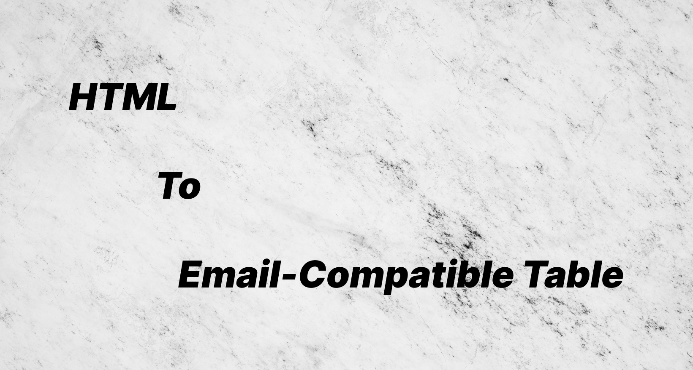

# HTML To Email-Compatible Table



> DEMO: https://w99910.github.io/html-to-table/

### It's zero dependency and light-weight.

I have been trying to send emails using html layout but there are lots of html elements and styles that email clients
don't support.

So I am working on this library to convert almost html layout to email-compatible table layout.

> Note: I don't guarantee that this library can convert any html element to your desired layout all the time. Feel free to tune the result as you want.

## Installation

Choose one of the following methods.
- NPM
```
npm i html-to-table
```

- Github ESM Module
```
import HTML2Table from 'https://github.com/w99910/html-to-table/blob/master/dist/html-to-table.js'
```

- Github CJS

```js
const HTML2Table = require('https://github.com/w99910/html-to-table/blob/master/dist/html-to-table.cjs')
```


## Usage

It is pretty straight-forward to use.

- Initialise the class

```js
let html2table = new HTML2Table();
```

- (Optional) - You can filter the elements you don't want to include in the output using Regex Expression
  This checks the `class` name and `id`.

```js
html2table.excludeElementByPattern('toolbar')
```

- Convert the element you want by calling `convert` and passing the element as parameter.

```js
html2table.convert(document.querySelector('your-element-to-convert'));
```

## Tips

- I suggest you target mobile device layout first so that the layout will work both on mobile and desktop.
- `Base64` image data does not work. So host the image on cloud and use it.
- Don't use `linear-gradient` css function in inline css. Instead, create the gradient as an image and load it using `url`.
    ```js
    style="background: url('link-to-your-image')"
    ```
- Use `background-color` as a fall-back background color if image would not be working in some email clients.

## LICENSE
[MIT License](LICENSE)

## Articles

- [Medium Article](https://medium.com/@thomasbrillion/html-to-email-compatible-table-%EF%B8%8F-fb33481d231b)
- [Dev.to](https://dev.to/thomas_brillion/html-to-email-31k9)

## CHANGELOG

- **0.1.2**
  - Add `bgcolor` attribute for fall-back `background` css style.
  - `align` and `valign` of table now consider the css properties of parent element. if there is no parent element, default value will be used. 
  -  Deprecated feature that convert SVG to Base64 PNG. 
- **0.1.1** 
  - Add `alt` and `title` to allowed attribute when it is cloned. 
  - Fix `width` being `0` in some cases.
- **0.1.0** - Rewrite the logic by using bounding client rect to determine the layout
